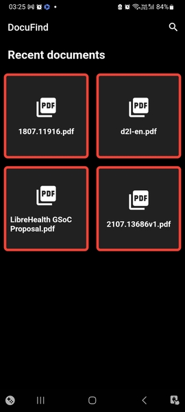

# raptor-trio

## DocuFind

## Demo




### Overview

This is a PDF reader app built using Flutter, which provides the following features:

* Search the PDF file for words, sentences, or phrases

* Google search the selected text

* Convert selected text to speech

* Local database to store the history of files opened


### Getting Started

To get started with this project, you will need to have Flutter installed on your system. You can download and install it from the official Flutter website.

Once you have Flutter installed, clone the repository and run the following command to install the required dependencies:

```
flutter pub get
```


### Usage

To use the app, simply open it on your device or emulator. You will be presented with a list of the most recently opened PDF files. To open a new PDF file, click the search icon in the top right corner and select the file from your device.

Once you have a PDF file open, you can search for specific words, sentences, or phrases using the search bar at the top of the screen. You can also select text from the PDF and choose to either Google search it or convert it to speech.

All the PDF files that you open with the app will be stored in a local database, so you can easily access them again in the future.